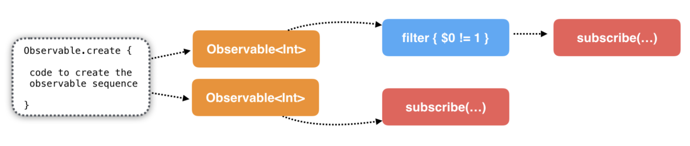
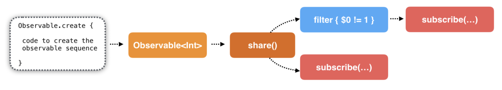
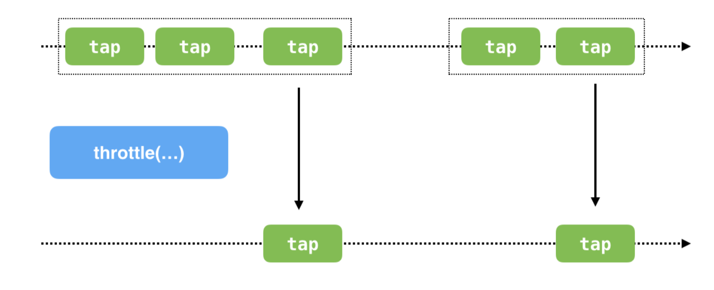

### Chap 06 :  Filtering Operators in Practice

#### share()

Every times you call `Observable.create` or `subject.asObservable` it created a new Observable instance. It can make the change of data out of control. So, `share()` is a good solution for avoid it.


Simple call `subject.asObservable` or `Observable.create`


Using share()



#### take(:, scheduler:)
```
take(5.0, scheduler: MainScheduler.instance)
```
waiting for 5 second, if Observable still not call `onComplete`, auto call `onComplete`

#### throttle
Using throttle for avoid multiple action in a short time
```
Observable()
.throttle(1.0, scheduler: MainScheduler.instance)
.subscribe(onNext: { [unowned self] photos in
    // action
}).disposed(by: bag)
```


