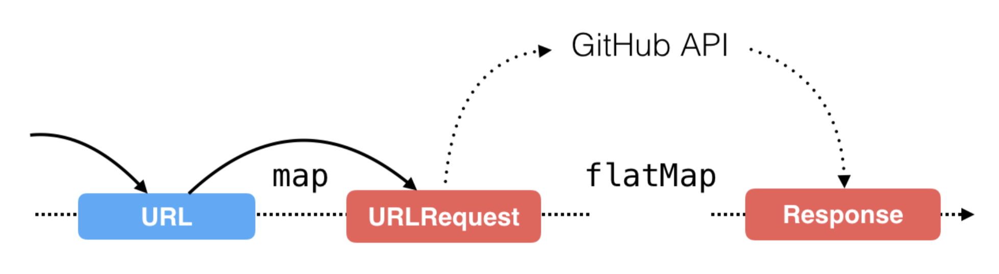

## Chap 08 : Transforming Operators in Practice

#### 1. Difference from `flatmap` and `map`



#### 2. share(replay: scope) in network request

```
observerable.share(replay: 1, scope: SubjectLifetimeScope.whileConnected)
```

The request will fire one time and get the same result. So using `replay` as cache data and immediately return for any newly subscribed observer.

**`.whileConnected` and `.forever`**

||.whileConnected|.forever|
|--|--|
|Keep time|until there are no more subscibers|forever|
|Memory issue|release cache when has no more subscibers| Keep the cache until close app |
