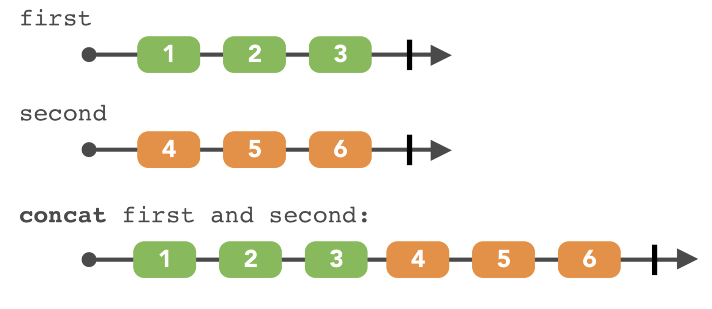
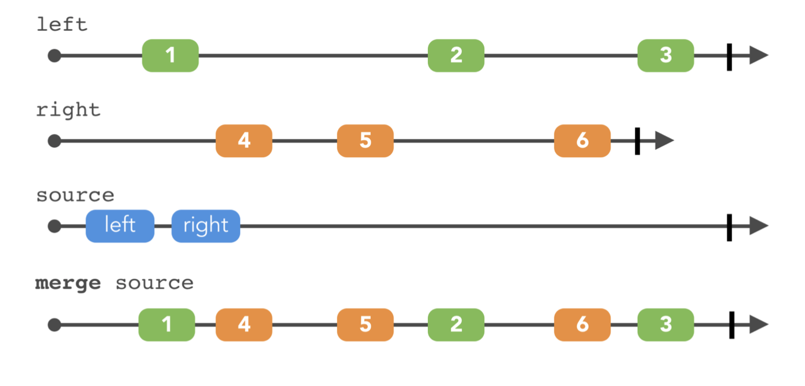
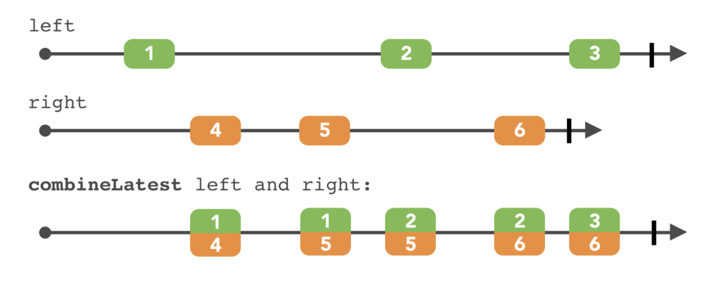
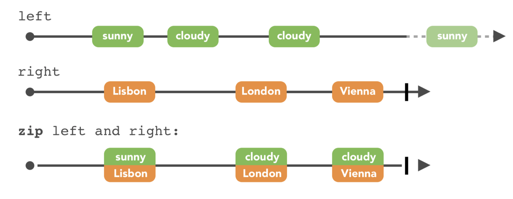
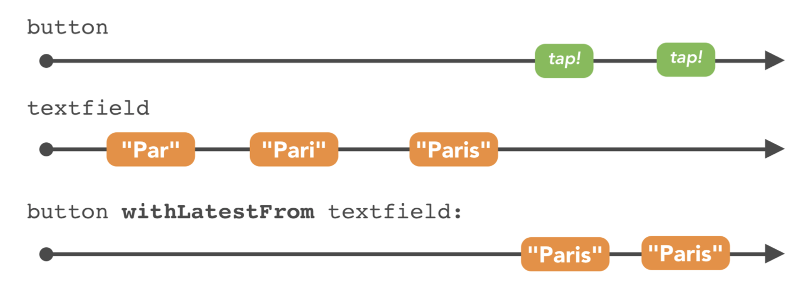
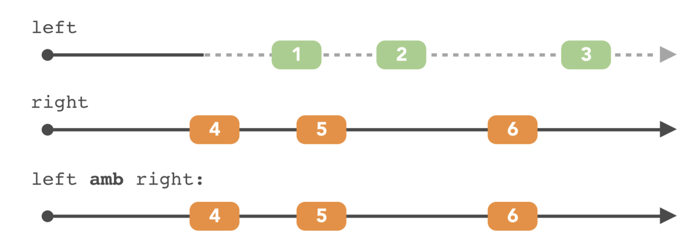
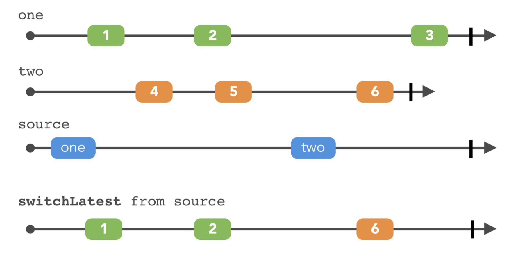
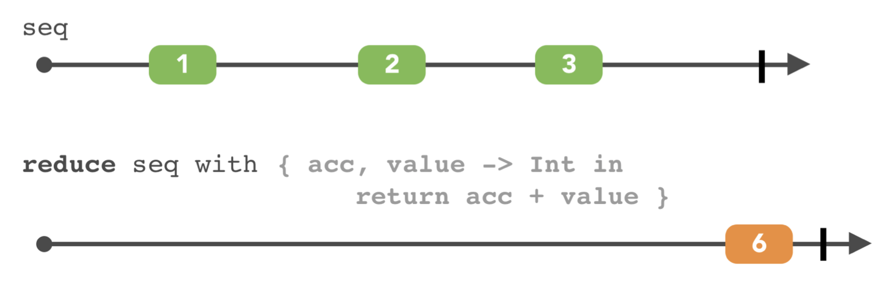
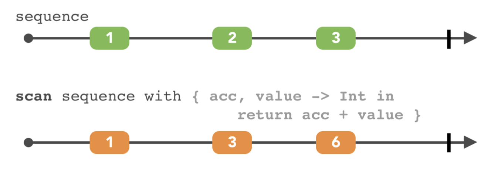

### Chap 09 : Combining Operators

#### 1. Concat

#### 2. Merging

#### 3. Combining

#### 4. Zip

#### 5. Trigger

#### 6. Switches

Switch from lastest

#### 7. Combining elements within a sequence

Reduce

Scan

